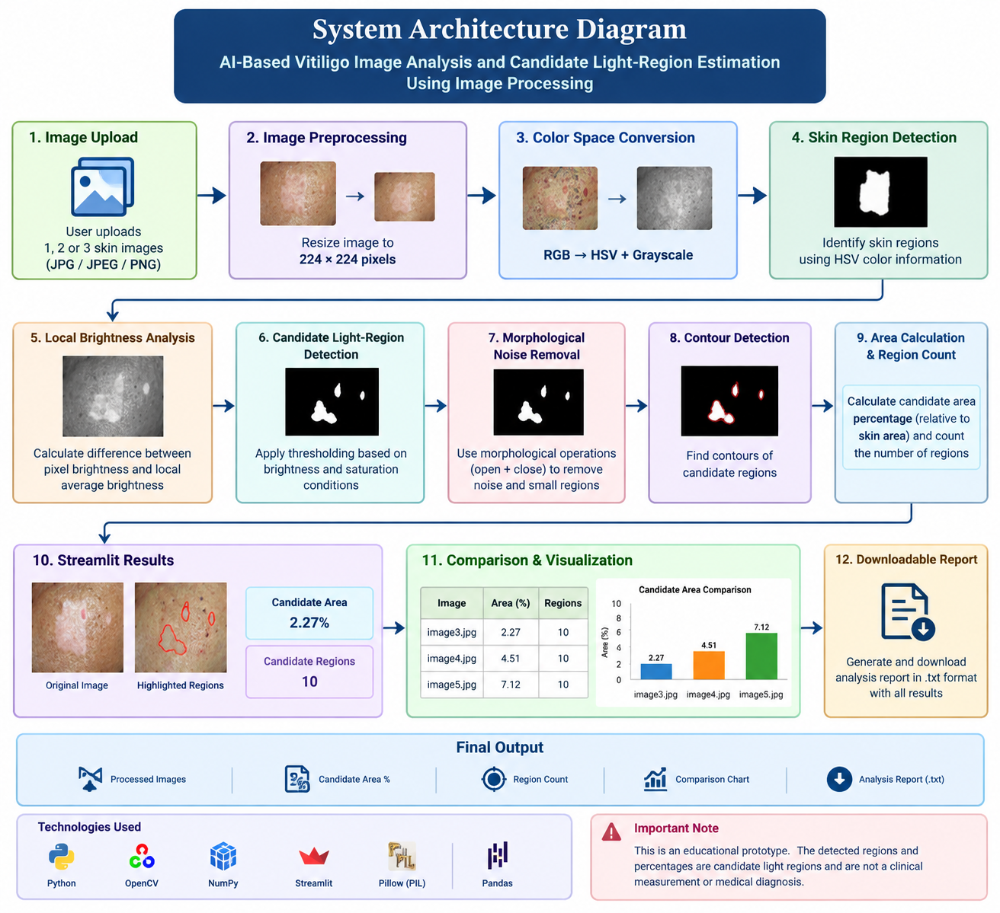

# AI-Based Vitiligo Image Analysis and Candidate Light-Region Estimation Using Image Processing

## 1. Introduction

Vitiligo is a skin condition associated with the appearance of lighter regions on the skin. Observing and comparing these regions manually in different images can be difficult.

This project presents an educational image-processing prototype that analyzes skin images and identifies candidate light regions. The system uses Python, OpenCV, NumPy, Pillow, Pandas, and Streamlit to process images and present the results.

The system estimates the relative area of detected candidate light regions, counts the detected regions, compares multiple images, displays the results using a bar chart, and generates a downloadable analysis report.

This project is developed for educational and demonstration purposes and is not intended for clinical diagnosis or medical decision-making.

---

## 2. Problem Statement

Manually observing and comparing light regions in skin images can be difficult and time-consuming.

Therefore, this project aims to develop an image-processing prototype that can analyze skin images, identify candidate light regions, estimate their relative area, count detected regions, and provide visual and numerical comparison between multiple images.

---

## 3. Objectives

The main objectives of the project are:

1. To accept skin images through a web interface.
2. To preprocess images using OpenCV.
3. To identify candidate light regions using image-processing techniques.
4. To estimate the relative area of candidate light regions.
5. To count the detected candidate regions.
6. To compare up to three images.
7. To display comparison results using a bar chart.
8. To generate a downloadable analysis report.
9. To provide a simple Streamlit-based user interface.
10. To distinguish prototype output from clinical diagnosis.

---

# 4. Proposed System

## 4.1 System Architecture

The proposed system follows the workflow:

**Image Upload → Image Preprocessing → Skin Region Detection → Candidate Light-Region Detection → Area Calculation → Results → Comparison Chart → Downloadable Report**

### System Architecture Diagram



**Figure 4.1: System Architecture of the Proposed System**

The system receives skin images from the user and processes them using image-processing techniques. The processed images are analyzed to identify candidate light regions. The system then estimates the relative candidate area, counts detected regions, displays comparison results, and generates a downloadable report.

---

## 4.2 Module Description

### 4.2.1 Image Upload Module

The Image Upload Module allows the user to upload one or more skin images through the Streamlit web interface. The system accepts common image formats such as JPG, JPEG, and PNG.

**Input:** Skin image

**Output:** Uploaded image ready for preprocessing

---

### 4.2.2 Image Preprocessing Module

The Image Preprocessing Module prepares the uploaded images for further analysis. The images are resized to 224 × 224 pixels to maintain a consistent input size.

OpenCV is used for image reading and resizing.

**Input:** Uploaded image

**Output:** Resized image

---

### 4.2.3 Skin Region Detection Module

This module uses color information to identify regions corresponding to skin. HSV color representation is used as part of the image-processing process to create a skin-region mask.

**Input:** Preprocessed image

**Output:** Skin-region mask

---

### 4.2.4 Candidate Light-Region Detection Module

This module analyzes brightness differences within the detected skin regions. Regions satisfying the selected image-processing conditions are identified as candidate light regions.

Morphological operations are also applied to reduce unwanted small regions.

**Input:** Skin-region mask and image information

**Output:** Candidate light-region mask

---

### 4.2.5 Area Estimation Module

The Area Estimation Module calculates the relative percentage of the image area occupied by detected candidate light regions.

The estimated percentage is calculated based on the number of candidate pixels compared with the analyzed image area.

**Output:** Estimated candidate area percentage

---

### 4.2.6 Region Counting Module

This module identifies separate candidate regions using contour detection.

The system counts the detected candidate regions and displays the total number to the user.

**Output:** Candidate region count

---

### 4.2.7 Comparison and Visualization Module

This module compares the analysis results of multiple images.

The system displays:

- Image names
- Estimated candidate area percentage
- Candidate region count
- Comparison table
- Bar chart

The comparison helps visualize differences between the processed images.

---

### 4.2.8 Report Generation Module

The Report Generation Module creates a downloadable text report.

The report contains:

- Image names
- Estimated candidate area
- Candidate region count
- Important project disclaimer

The report can be downloaded directly from the Streamlit application.

---

# 5. Technologies Used

The following technologies are used in the project:

### 5.1 Python

Python is used as the main programming language for implementing the image-processing workflow.

### 5.2 OpenCV

OpenCV is used for image reading, resizing, color conversion, masking, morphological operations, and contour detection.

### 5.3 NumPy

NumPy is used for numerical calculations and image-array operations.

### 5.4 Pillow

Pillow is used to handle uploaded image files in the Streamlit application.

### 5.5 Pandas

Pandas is used to organize and display comparison results in tabular form.

### 5.6 Streamlit

Streamlit is used to create the interactive web interface for image upload, analysis, visualization, and report generation.

---

# 6. System Implementation

The project is implemented using multiple Python files.

## 6.1 Project Structure

```text
vetiligo_AI_Project
│
├── area_estimation.py
├── image_preprocessing.py
├── vitiligo_detection.py
├── app.py
├── Project_Report.md
├── system_architecture.png
│
└── dataset
    ├── raw
    │   ├── image3.jpg
    │   ├── image4.jpg
    │   └── image5.jpg
    │
    ├── processed
    │   ├── image3.jpg
    │   ├── image4.jpg
    │   └── image5.jpg
    │
    └── results
        ├── image3_detection_result.jpg
        ├── image4_detection_result.jpg
        ├── image5_detection_result.jpg
        ├── image3_analysis_report.txt
        ├── comparison_report.txt
        ├── image3_improved_result.jpg
        ├── image4_improved_result.jpg
        ├── image5_improved_result.jpg
        └── improved_comparison_report.txt
        # AI-Based Vitiligo Image Analysis and Candidate Light-Region Estimation Using Image Processing

## 1. Introduction

Vitiligo is a skin condition associated with the appearance of lighter regions on the skin. Observing and comparing these regions manually in different images can be difficult.

This project presents an educational image-processing prototype that analyzes skin images and identifies candidate light regions. The system uses Python, OpenCV, NumPy, Pillow, Pandas, and Streamlit to process images and present the results.

The system estimates the relative area of detected candidate light regions, counts the detected regions, compares multiple images, displays the results using a bar chart, and generates a downloadable analysis report.

This project is developed for educational and demonstration purposes and is not intended for clinical diagnosis or medical decision-making.

---

## 2. Problem Statement

Manually observing and comparing light regions in skin images can be difficult and time-consuming.

Therefore, this project aims to develop an image-processing prototype that can analyze skin images, identify candidate light regions, estimate their relative area, count detected regions, and provide visual and numerical comparison between multiple images.

---

## 3. Objectives

The main objectives of the project are:

1. To accept skin images through a web interface.
2. To preprocess images using OpenCV.
3. To identify candidate light regions using image-processing techniques.
4. To estimate the relative area of candidate light regions.
5. To count the detected candidate regions.
6. To compare up to three images.
7. To display comparison results using a bar chart.
8. To generate a downloadable analysis report.
9. To provide a simple Streamlit-based user interface.
10. To distinguish prototype output from clinical diagnosis.

---

# 4. Proposed System

## 4.1 System Architecture

The proposed system follows the workflow:

**Image Upload → Image Preprocessing → Skin Region Detection → Candidate Light-Region Detection → Area Calculation → Results → Comparison Chart → Downloadable Report**

### System Architecture Diagram


**Figure 4.1: System Architecture of the Proposed System**

The system receives skin images from the user and processes them using image-processing techniques. The processed images are analyzed to identify candidate light regions. The system then estimates the relative candidate area, counts detected regions, displays comparison results, and generates a downloadable report.

---

## 4.2 Module Description

### 4.2.1 Image Upload Module

The Image Upload Module allows the user to upload one or more skin images through the Streamlit web interface. The system accepts common image formats such as JPG, JPEG, and PNG.

**Input:** Skin image

**Output:** Uploaded image ready for preprocessing

---

### 4.2.2 Image Preprocessing Module

The Image Preprocessing Module prepares the uploaded images for further analysis. The images are resized to 224 × 224 pixels to maintain a consistent input size.

OpenCV is used for image reading and resizing.

**Input:** Uploaded image

**Output:** Resized image

---

### 4.2.3 Skin Region Detection Module

This module uses color information to identify regions corresponding to skin. HSV color representation is used as part of the image-processing process to create a skin-region mask.

**Input:** Preprocessed image

**Output:** Skin-region mask

---

### 4.2.4 Candidate Light-Region Detection Module

This module analyzes brightness differences within the detected skin regions. Regions satisfying the selected image-processing conditions are identified as candidate light regions.

Morphological operations are also applied to reduce unwanted small regions.

**Input:** Skin-region mask and image information

**Output:** Candidate light-region mask

---

### 4.2.5 Area Estimation Module

The Area Estimation Module calculates the relative percentage of the image area occupied by detected candidate light regions.

The estimated percentage is calculated based on the number of candidate pixels compared with the analyzed image area.

**Output:** Estimated candidate area percentage

---

### 4.2.6 Region Counting Module

This module identifies separate candidate regions using contour detection.

The system counts the detected candidate regions and displays the total number to the user.

**Output:** Candidate region count

---

### 4.2.7 Comparison and Visualization Module

This module compares the analysis results of multiple images.

The system displays:

- Image names
- Estimated candidate area percentage
- Candidate region count
- Comparison table
- Bar chart

The comparison helps visualize differences between the processed images.

---

### 4.2.8 Report Generation Module

The Report Generation Module creates a downloadable text report.

The report contains:

- Image names
- Estimated candidate area
- Candidate region count
- Important project disclaimer

The report can be downloaded directly from the Streamlit application.

---

# 5. Technologies Used

The following technologies are used in the project:

### 5.1 Python

Python is used as the main programming language for implementing the image-processing workflow.

### 5.2 OpenCV

OpenCV is used for image reading, resizing, color conversion, masking, morphological operations, and contour detection.

### 5.3 NumPy

NumPy is used for numerical calculations and image-array operations.

### 5.4 Pillow

Pillow is used to handle uploaded image files in the Streamlit application.

### 5.5 Pandas

Pandas is used to organize and display comparison results in tabular form.

### 5.6 Streamlit

Streamlit is used to create the interactive web interface for image upload, analysis, visualization, and report generation.

---

# 6. System Implementation

The project is implemented using multiple Python files.

## 6.1 Project Structure

```text
vetiligo_AI_Project
│
├── area_estimation.py
├── image_preprocessing.py
├── vitiligo_detection.py
├── app.py
├── Project_Report.md
├── system_architecture.png
│
└── dataset
    ├── raw
    │   ├── image3.jpg
    │   ├── image4.jpg
    │   └── image5.jpg
    │
    ├── processed
    │   ├── image3.jpg
    │   ├── image4.jpg
    │   └── image5.jpg
    │
    └── results
        ├── image3_detection_result.jpg
        ├── image4_detection_result.jpg
        ├── image5_detection_result.jpg
        ├── image3_analysis_report.txt
        ├── comparison_report.txt
        ├── image3_improved_result.jpg
        ├── image4_improved_result.jpg
        ├── image5_improved_result.jpg
        └── improved_comparison_report.txt